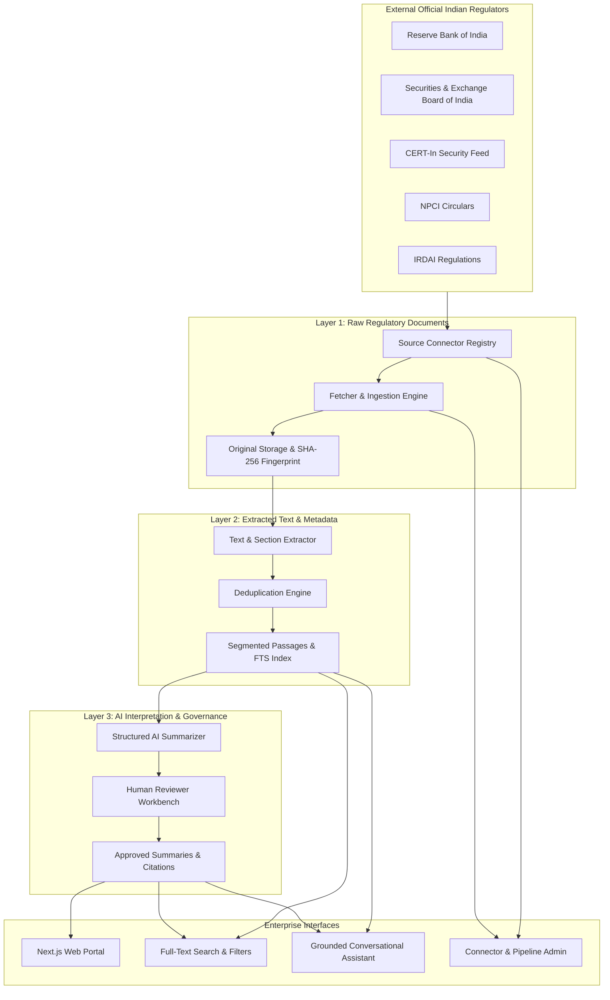

# Regulatory Intelligence Hub India

A production-grade regulatory intelligence and compliance research web platform engineered for Indian financial institutions, digital payment operators, cloud governance, cybersecurity, audit, and risk professionals.

The platform continuously tracks, indexes, extracts, and summarizes regulatory publications from five key Indian regulators:
1. **Reserve Bank of India (RBI)**
2. **Securities and Exchange Board of India (SEBI)**
3. **Indian Computer Emergency Response Team (CERT-In)**
4. **National Payments Corporation of India (NPCI)**
5. **Insurance Regulatory and Development Authority of India (IRDAI)**

---

## The Three-Layer Content Separation Principle

The platform strictly enforces architectural separation between official authoritative artifacts and platform interpretations:

| Layer | Component | Description | Mutability |
|---|---|---|---|
| **Layer 1** | **Official Regulatory Artifact** | Immutable raw PDF/HTML downloaded from official government endpoints, fingerprinted with SHA-256 cryptographic hashes and canonical URLs. | Strictly Immutable |
| **Layer 2** | **Authoritative Extracted Text** | Normalized plain text, page/section segmentation, and paragraph reference offsets. Authoritative ground truth for search and citations. | Immutable |
| **Layer 3** | **AI Interpretation & Impact** | Executive summaries, mandatory obligations, timelines, triple-impact analysis, and suggested operational considerations. Explicitly badged as platform interpretations. | Versioned & Audited |

> **Statutory Notice:** Regulatory Intelligence Hub India is an information aggregation and research system. It does not provide legal advice, compliance certification, or formal regulatory determinations.

---

## System Architecture



---

## Key Features

1. **Multi-Faceted Search & Match Reasoning (`/search`, `/updates`)**:
   - Exact circular number matching (e.g. `RBI/2023-24/107`, `CIVN-2024-0312`).
   - Keyword and full-text search across titles, provisions, and summaries.
   - Relevancy ranking with passage snippet highlighting and explanation of why each result matched.
2. **Grounded Conversational Assistant (`/assistant`)**:
   - Answers strictly from retrieved indexed regulatory text (no hallucination or outside model assumptions).
   - 7-part required answer format: (1. Direct Answer, 2. Applicability, 3. Key Requirements, 4. Important Dates, 5. Suggested Operational Considerations, 6. Citations, 7. Limitations).
   - Refusal clause: *"I could not find sufficient supporting information in the indexed official documents."*
   - Anti-prompt injection defense: Treats prompt overrides inside document text as untrusted data.
   - Alert banners when querying superseded or withdrawn circulars.
3. **Document Detail Hierarchy (`/documents/[id]`)**:
   - Complete 3-tier view with tabbed access to Layer 1 metadata, Layer 2 extracted text, and Layer 3 AI interpretations.
   - Supporting citations drawer showing verbatim quotes.
   - Document lineage tracking (amended, superseded, and withdrawn relationships).
4. **Reviewer Workbench (`/reviewer`)**:
   - Side-by-side verification screen comparing extracted source text with AI-synthesized summaries.
   - Actions: **Approve & Verify**, **Reject**, or **Request Regeneration**.
   - Immutable audit logging on all review actions. Reviewers cannot alter Layer 1 or Layer 2.
5. **Source Connector Administration (`/admin`)**:
   - Real-time connector health telemetry, last-polled timestamps, and failure retry counters.
   - One-click manual synchronization trigger.
   - Manual document upload form for emergency circulars.
6. **Watchlists & Digest Simulator (`/watchlists`)**:
   - Custom combinations of regulators (RBI, SEBI, CERT-In, NPCI, IRDAI) and risk domains (Cybersecurity, Cloud, Incident Reporting).
   - Live email digest simulation preview.
7. **Saved Searches & Bookmarks (`/saved`)**:
   - One-click rerun of saved queries and bookmark management.

---

## Local Setup & Quickstart

### Prerequisites
- Node.js `v20+` or `v22+`
- npm `v10+`

### 1. Installation
Clone the repository and install dependencies:
```bash
git clone <repository-url>
cd Regulator-Agg
npm install
```

### 2. Configure Environment
A default `.env` is pre-configured for instant zero-dependency local development using SQLite:
```bash
cp .env.example .env
```

```env
DATABASE_URL="file:./dev.db"
NODE_ENV="development"
AI_PROVIDER="local-rule-grounded"
NEXT_PUBLIC_APP_NAME="Regulatory Intelligence Hub India"
NEXT_PUBLIC_APP_URL="http://localhost:3000"
CRAWLER_USER_AGENT="RegulatoryIntelligenceHubBot/1.0 (+https://regulatoryintelligencehub.in/bot; compliance-research)"
```

### 3. Database Migration & Seed
Run Prisma database sync and populate the database with seed regulators, topics, roles, and verified fixtures:
```bash
# Push schema to SQLite
npm run prisma:push

# Seed topics, regulators, sample circulars, and connectors
npm run prisma:seed
```

### 4. Run Automated Test Suite
Run the full unit, integration, and safety test suite (14/14 automated tests):
```bash
npm test
```

### 5. Start Development Server
```bash
npm run dev
```
Open **[http://localhost:3000](http://localhost:3000)** in your browser.

---

## Application Navigation Routes

| Route | Page | Purpose |
|---|---|---|
| `/` | **Home Page** | Hero, search bar, regulator badges, latest developments grid, topic pills, architecture overview. |
| `/updates` | **Regulatory Updates Catalog** | Multi-faceted filtering (regulator, topic, document type, status, verification), pagination, search. |
| `/documents/[id]` | **Document Detail Page** | 3-tier visual hierarchy, metadata, extracted text, AI summary, mandatory vs advisory obligations, citations. |
| `/search` | **Search Results Page** | Keyword & document number search with passage snippet highlighting and "Why It Matched" indicators. |
| `/assistant` | **Regulatory Assistant** | Grounded conversational RAG chat with starter questions, scope filtering, and 7-part citations. |
| `/watchlists` | **Custom Watchlists** | Watchlist builder and live email digest simulation preview. |
| `/saved` | **Bookmarks & Searches** | Saved document bookmarks and one-click query rerun. |
| `/reviewer` | **Reviewer Workbench** | Protected queue for documents in `PENDING_REVIEW` with side-by-side inspection and audit logs. |
| `/admin` | **Administration Dashboard**| Connector health, sync triggers, job execution logs, and manual document ingestion. |

---

## Security & AI Safety Implementation

1. **Prompt Injection Defense**:
   - Untrusted regulatory documents are structurally delimited (`<<<UNTRUSTED_REGULATORY_EXTRACTS_START>>>` ... `<<<UNTRUSTED_REGULATORY_EXTRACTS_END>>>`).
   - Instructions contained within external regulatory documents to override prompts, reveal secrets, or change application behavior are ignored and treated strictly as passive text.
2. **Deterministic Grounding & Zero Hallucination**:
   - The conversational assistant is prohibited from using general model knowledge to invent regulatory obligations.
   - If an indexed document does not contain supporting passages for a query, the assistant deterministically returns:
     *"I could not find sufficient supporting information in the indexed official documents."*
3. **Role-Based Access Control (RBAC)**:
   - 4 simulated roles: `VISITOR`, `REGISTERED_USER`, `REVIEWER`, `ADMINISTRATOR`.
   - Reviewer workbench and admin operational endpoints require designated elevated privileges.
4. **Data Integrity & Layer Immutability**:
   - Cryptographic SHA-256 fingerprinting on all ingested documents.
   - Reviewer actions cannot modify Layer 1 original documents or Layer 2 authoritative extracted text.

---

## Known Limitations & Production Roadmap

### Known Limitations in MVP
1. **Database Engine**: Uses SQLite (`file:./dev.db`) for immediate zero-friction local development. For high-concurrency production deployments with millions of documents, switch `provider = "postgresql"` in `prisma/schema.prisma` and enable native PostgreSQL `tsvector` full-text search.
2. **OCR for Scanned PDFs**: Document extraction currently processes text-based PDFs and HTML. Scanned non-searchable PDF circulars require enabling a Tesseract/Google Cloud Vision OCR worker in the ingestion pipeline.
3. **Automated Scraping Gateways**: CERT-In live advisories are fully functional. Regulators with dynamic JavaScript or Cloudflare challenge pages (e.g. SEBI dynamic listings) are safeguarded with connector shells and fixture fallbacks to guarantee reliability without violating terms of service.

### Prioritized Backlog for Release 2.0
- [ ] **Dual-Engine Hybrid Search**: Integrate `pgvector` or Pinecone for semantic dense embeddings combined with BM25 keyword matching.
- [ ] **Automated Daily Ingestion Cron**: Scheduled background worker with BullMQ / Redis for automated periodic polling.
- [ ] **PDF Highlighting Overlay**: Direct PDF.js canvas viewer rendering highlighted citation bounding boxes directly on original PDF pages.
- [ ] **Webhook & Slack Notifications**: Push high-impact circular alerts directly to enterprise Slack or Microsoft Teams compliance channels.
- [ ] **Regulatory Diff Engine**: Automated clause-by-clause diff comparison between an amending direction and the original circular.
