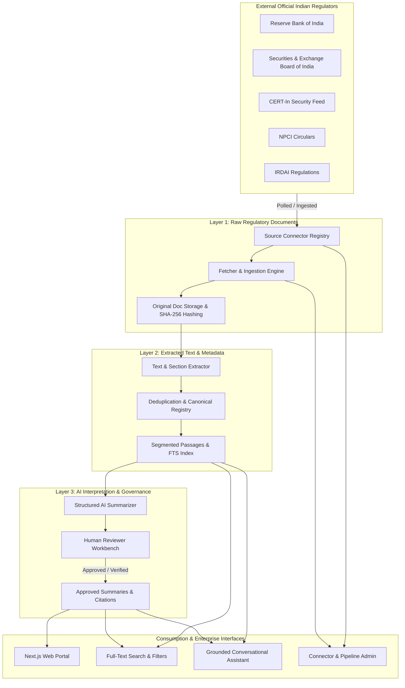

# System Architecture: Regulatory Intelligence Hub India

## 1. Architectural Overview & Design Philosophy

**Regulatory Intelligence Hub India** is an enterprise-grade regulatory information discovery and conversational research platform. It is engineered around three non-negotiable principles:
1. **Three-Layer Content Separation**: Official raw documents, extracted plain text, and AI-generated interpretations remain strictly decoupled.
2. **Deterministic Source Traceability**: No statement or obligation can be presented in conversational answers or structured summaries without an explicit citation pointing to a verifiable passage and section in the official document.
3. **Defense-in-Depth & Prompt Isolation**: Regulatory documents from external sources are treated as untrusted user-supplied data. System prompts are structurally delimited from retrieved text to prevent prompt injection attacks.



---

## 2. The Three Content Layers

| Layer | Name | Nature | Mutability | Storage Target | Presentation Guardrails |
|---|---|---|---|---|---|
| **Layer 1** | **Original Document** | Official PDF / HTML binary or source text as published by regulator | Immutable; cryptographic SHA-256 hash | File storage / Object storage + DB metadata | Link to official URL + original download link |
| **Layer 2** | **Extracted Text** | Authoritative normalized plain text, paragraph & section segments | Immutable after extraction; re-extractable only via pipeline | PostgreSQL / SQLite `extractedText` + `SourceCitation` | Exact verbatim quotes with section & page markers |
| **Layer 3** | **AI Interpretation** | Executive summary, affected entities, key requirements, operational impacts | Mutable via reviewer review; versioned prompt outputs | `RegulatorySummary` + `DocumentTopic` | Explicit badge: *"Platform-Generated Interpretation — Not Legal Advice"* |

---

## 3. Subsystem Architecture

### 3.1 Ingestion & Connector Framework
The system uses an abstract connector architecture (`BaseSourceConnector`):
- **Lifecycle Methods**:
  - `checkForUpdates()`: Checks RSS / feed / circular tables with exponential backoff and rate-limiting.
  - `listDocuments(since: Date)`: Enumerates candidates.
  - `fetchDocumentMetadata(id)`: Extracts document number, publication date, title, official source URL.
  - `downloadOriginalDocument(url)`: Downloads artifact and computes SHA-256 fingerprint.
  - `extractText(buffer, mimeType)`: Normalizes HTML/PDF to text and extracts sections.
  - `detectDuplicate(hash, docNumber)`: Identifies cross-URL reprints.
  - `reportHealth()`: Emits telemetry metrics to `IngestionJob`.

### 3.2 Search & Retrieval Service
- **Full-Text Search Engine**: Built using database full-text indices (`to_tsvector` in PostgreSQL / SQLite FTS5 pattern) across titles, document numbers, extracted text, and summaries.
- **Provider Interface**: A generic `SearchProvider` interface enables drop-in integration with Pinecone, pgvector, or OpenSearch for hybrid keyword + dense vector search while preserving result provenance.
- **Result Explanations**: Search responses explicitly detail match criteria (`Matched in Document Number`, `Matched in Title`, `Matched in Extracted Section 4.2`).

### 3.3 AI Grounded Assistant (RAG Pipeline)
- **Prompt Isolation**:
  ```text
  [SYSTEM INSTRUCTION: You are the Regulatory Assistant. Answer strictly from the excerpts below...]
  <<<UNTRUSTED_REGULATORY_EXTRACTS_START>>>
  [Document: CERT-In/ADV-2024-001 | Section: 3 | Official Source: https://...]
  ...
  <<<UNTRUSTED_REGULATORY_EXTRACTS_END>>>
  ```
- **Strict Guardrails**:
  1. *No Outside Knowledge*: Refuses to invent regulatory mandates.
  2. *Mandatory Structured Answer*: (Direct Answer -> Who It Applies To -> Key Requirements -> Important Dates -> Operational Considerations -> Citations).
  3. *Refusal Clause*: Returns *"I could not find sufficient supporting information in the indexed official documents."* whenever context lacks answers.
  4. *Conflict Resolution*: If documents conflict (e.g. an earlier circular contradicted by a master direction), both documents and their statuses are highlighted.

### 3.4 Governance & Reviewer Workbench
- AI-generated summaries begin in `AI_GENERATED` or `PENDING_REVIEW` state.
- Compliance reviewers can inspect the side-by-side comparison:
  - Left panel: Authoritative Extracted Text.
  - Right panel: AI-Generated Summary, Obligations, Impact Tags.
- Actions: **Approve** (marks `HUMAN_REVIEWED` or `VERIFIED`), **Reject**, or **Request Regeneration**.
- Reviewers cannot alter the underlying original document or extracted text.

---

## 4. Security Architecture

1. **Role-Based Access Control (RBAC)**:
   - `VISITOR`: Public discovery, search, view public summaries and official sources.
   - `REGISTERED_USER`: Save bookmarks, custom watchlists, export summaries, conversational assistant.
   - `REVIEWER`: Access reviewer workbench, approve/reject summaries, append compliance annotations.
   - `ADMINISTRATOR`: Manage connectors, trigger sync, view failed jobs, inspect audit logs, manual doc upload.
2. **Defensive Ingestion**:
   - PDF size limits (max 25MB) and mime-type verification.
   - Denial-of-Service / Zip-bomb prevention in document parsing.
   - Rate limiting on all search and chat endpoints.
3. **Audit Trail**: Every administrative action, document state change, and review decision creates an immutable `AuditLog` row.
