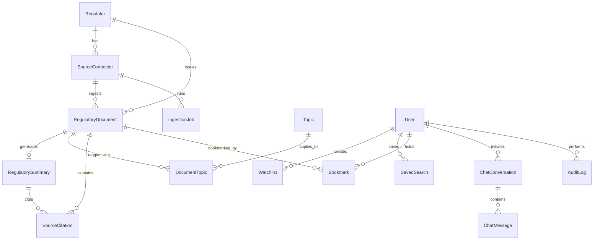

# Data Model Specification: Regulatory Intelligence Hub India

## 1. Controlled Vocabularies & Enums

### Document Current Status
- `NEW`: Ingested within the last 7 calendar days.
- `CURRENT`: In force and actively applicable.
- `AMENDED`: Modified in part by a subsequent notification or direction.
- `SUPERSEDED`: Fully replaced by a newer master direction or circular.
- `WITHDRAWN`: Formally rescinded or cancelled by the issuing regulator.
- `UNKNOWN`: Status could not be conclusively determined.

### Verification Status
- `AI_GENERATED`: Summary synthesized via model; awaiting human compliance review.
- `PENDING_REVIEW`: Queued in reviewer workbench.
- `HUMAN_REVIEWED`: Inspected and verified by a designated compliance reviewer.
- `VERIFIED`: Formally ratified with high confidence.
- `REJECTED`: Found inaccurate, distorted, or hallucinated; withheld from public index.

### Extraction Status
- `PENDING`: Enqueued for text extraction.
- `EXTRACTED`: Plain text and sections successfully extracted.
- `PARTIAL`: Incomplete extraction (e.g., scanned PDF with poor contrast or missing pages).
- `FAILED`: Parsing failed (e.g., corrupted file, password-protected PDF).

### User Roles
- `VISITOR`: Read-only access to published documents, basic search.
- `REGISTERED_USER`: Personalized watchlists, saved searches, bookmarks, conversational assistant.
- `REVIEWER`: Access to Reviewer Workbench, approve/reject/annotate summaries.
- `ADMINISTRATOR`: System settings, connector management, manual uploads, audit logs.

---

## 2. Entity Relationship Schema

---

## 3. Detailed Entity Definitions

### 1. `Regulator`
| Field | Type | Description |
|---|---|---|
| `id` | String (CUID/UUID) PK | Unique identifier |
| `name` | String | Full name (e.g. "Reserve Bank of India") |
| `shortName` | String | Acronym (e.g. "RBI") |
| `officialWebsite` | String | URL to regulator official portal |
| `description` | String | Scope of mandate and regulatory jurisdiction |
| `jurisdiction` | String | Default: "India" |
| `active` | Boolean | Whether active in continuous monitoring |
| `createdAt`, `updatedAt` | DateTime | Timestamps |

### 2. `SourceConnector`
| Field | Type | Description |
|---|---|---|
| `id` | String PK | Unique identifier |
| `regulatorId` | String FK | Reference to Regulator |
| `sourceName` | String | e.g. "CERT-In Security Advisories Feed" |
| `sourceUrl` | String | Official feed or circulars URL |
| `sourceType` | String | `RSS`, `HTML_TABLE`, `API`, `MANUAL` |
| `checkFrequency` | String | `HOURLY`, `DAILY`, `REALTIME` |
| `lastCheckedAt` | DateTime? | Last poll timestamp |
| `lastSuccessfulCheckAt`| DateTime? | Last error-free poll |
| `active` | Boolean | Connector enable flag |
| `status` | String | `HEALTHY`, `DEGRADED`, `ERROR` |
| `errorMessage` | String? | Latest error diagnostics |

### 3. `RegulatoryDocument` (Layer 1 & Layer 2)
| Field | Type | Description |
|---|---|---|
| `id` | String PK | Unique identifier |
| `regulatorId` | String FK | Reference to Regulator |
| `sourceConnectorId`| String? FK | Reference to SourceConnector |
| `title` | String | Official publication title |
| `documentNumber` | String? | Official circular/order number (e.g. "RBI/2023-24/105") |
| `documentType` | String | `MASTER_DIRECTION`, `CIRCULAR`, `ADVISORY`, `NOTIFICATION`, `GUIDELINE`, `ORDER` |
| `publicationDate` | DateTime | Official date of release |
| `effectiveDate` | DateTime? | Date of enforcement (null if unspecified) |
| `officialSourceUrl`| String | Authoritative public link |
| `originalFileUrl` | String? | Stored copy path or canonical download URL |
| `originalFileHash`| String? | SHA-256 fingerprint for deduplication |
| `extractedText` | String? | Authoritative normalized plain text (Layer 2) |
| `extractionStatus`| Enum | `PENDING`, `EXTRACTED`, `PARTIAL`, `FAILED` |
| `ingestionStatus` | String | `DISCOVERED`, `DOWNLOADED`, `PROCESSED` |
| `currentStatus` | Enum | `NEW`, `CURRENT`, `AMENDED`, `SUPERSEDED`, `WITHDRAWN`, `UNKNOWN` |
| `verificationStatus` | Enum | `AI_GENERATED`, `PENDING_REVIEW`, `HUMAN_REVIEWED`, `VERIFIED`, `REJECTED` |
| `supersedesDocumentId` | String? FK | Target document replaced |
| `amendedDocumentId` | String? FK | Target document amended |
| `withdrawnDate` | DateTime? | Rescission timestamp |
| `isDemo` | Boolean | True for local test fixtures (`[DEMO_DATA]`) |
| `createdAt`, `updatedAt` | DateTime | Timestamps |

### 4. `RegulatorySummary` (Layer 3)
| Field | Type | Description |
|---|---|---|
| `id` | String PK | Unique identifier |
| `regulatoryDocumentId`| String FK (Unique) | 1-to-1 link to RegulatoryDocument |
| `shortHeadline` | String | 1-2 sentence core alert |
| `executiveSummary` | String | High-level synthesis for senior management |
| `purpose` | String | Why the regulation was enacted |
| `affectedEntities` | String (JSON Array) | Entities impacted (Banks, NBFCs, Cloud Providers, Payment Gateways) |
| `keyRequirements` | String (JSON Array) | Structured mandatory obligations vs advisory guidelines |
| `advisoryRecommendations` | String (JSON Array) | Non-binding guidance |
| `importantDates` | String (JSON Array) | Compliance milestones, transition deadlines |
| `cybersecurityImpact` | String (JSON Array) | Specific security controls, reporting mandates |
| `technologyImpact` | String (JSON Array) | Cloud, architecture, API, and IT infrastructure impacts |
| `operationalImpact` | String (JSON Array) | Audit, training, vendor contract, BCP impacts |
| `suggestedConsiderations` | String (JSON Array) | Suggested operational considerations (explicitly non-binding) |
| `limitations` | String (JSON Array) | Stated boundaries & legal caveats |
| `confidence` | String | Internal extraction confidence rating (`HIGH`, `MEDIUM`, `LOW`) |
| `modelName` | String | e.g. "gemini-1.5-pro", "rule-grounded-v1" |
| `promptVersion` | String | e.g. "v1.2.0" |
| `generatedAt` | DateTime | Generation timestamp |
| `reviewedBy` | String? | Reviewer user identifier |
| `reviewedAt` | DateTime? | Review timestamp |
| `reviewStatus` | String | `PENDING`, `APPROVED`, `REJECTED` |
| `reviewerNotes` | String? | Audit notes from reviewer |

### 5. `Topic` & `DocumentTopic`
- `Topic`: `id`, `name`, `description`
- `DocumentTopic`: `regulatoryDocumentId`, `topicId`, `relevanceScore` (0.0 to 1.0)

### 6. `SourceCitation`
| Field | Type | Description |
|---|---|---|
| `id` | String PK | Unique identifier |
| `regulatoryDocumentId`| String FK | Reference to Document |
| `regulatorySummaryId` | String? FK | Reference to Summary |
| `sectionReference` | String | e.g. "Section 4.1(b)", "Paragraph 12" |
| `pageNumber` | Int? | Page number in original PDF |
| `paragraphText` | String | Verbatim quoted excerpt from Layer 2 |
| `textStartOffset` | Int? | Character start in normalized text |
| `textEndOffset` | Int? | Character end in normalized text |

### 7. User & Personalization Entities
- `User`: `id`, `name`, `email`, `role`, `organisation`, `createdAt`, `updatedAt`
- `Watchlist`: `id`, `userId`, `name`, `regulatorFilters` (JSON), `topicFilters` (JSON), `entityTypeFilters` (JSON), `frequency`, `active`
- `SavedSearch`: `id`, `userId`, `name`, `query`, `filters` (JSON), `createdAt`
- `Bookmark`: `id`, `userId`, `regulatoryDocumentId`, `createdAt`
- `ChatConversation`: `id`, `userId`, `title`, `documentId?`, `createdAt`, `updatedAt`
- `ChatMessage`: `id`, `conversationId`, `role`, `content`, `retrievalMetadata` (JSON with matched citations), `createdAt`
- `IngestionJob`: `id`, `sourceConnectorId`, `jobType`, `status`, `startedAt`, `completedAt`, `documentsFound`, `documentsCreated`, `documentsUpdated`, `retryCount`, `errorMessage`
- `AuditLog`: `id`, `userId?`, `action`, `resourceType`, `resourceId`, `details` (JSON), `createdAt`
